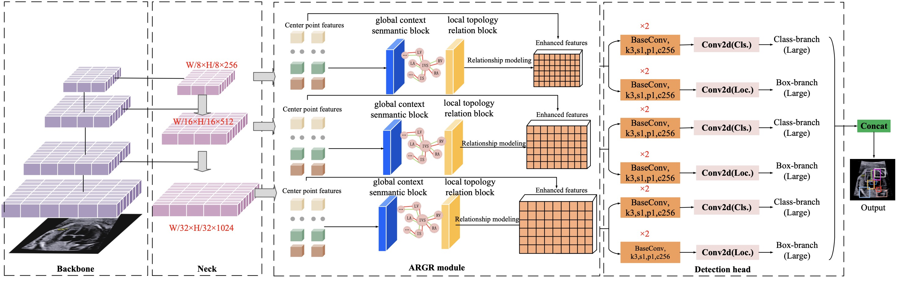

# Fetal Anatomy Reasoning Network

Introduction
===========
we propose a Fetal Anatomy Reasoning Network (FARN) that incorporates two kinds of relationship forms: a global context semantic block summarized with visual similarity and a local topology relationship block depicting structural pair constraints. Specifically, by designing the Adap- tive Relation Graph Reasoning (ARGR) module, anatomical structures are treated as nodes, with two kinds of rela- tionships between nodes modeled as edges. The flexibility of the model is enhanced by constructing the adaptive relationship graph in a data-driven way, enabling adapta- tion to various data samples without the need for predefined additional constraints. The feature representation is further refined by aggregating the outputs of the ARGR module.


Dataset
===========
The dataset consisted of 24,216 images from key US planes (including the fetal lumbosacral spine, facial region, four-chamber, abdomen, and craniocerebral planes) covering 37 key structures obtained during tertiary obstetric screening between 18 + 0 ∼ 22 + 6 gestational weeks.

⭐  In the future, our team will consider releasing a large fetal ultrasound dataset to support research related to fetal ultrasound. 

Results
===========
We provide some experimental visualizations here.

 Usage
===========

- [Installation](#installation)
- [Traing process](#Traing process)

## Installation

We used these packages/versions in the development of this project.

```
PyTorch = 1.8.0
torchvision = 0.9.0
opencv-python = 4.6.0
```

❤️  Let's get started！

```
# Create a new conda environment named FARN with Python 3.7
conda create -n FARN python=3.7

# Activate the FARN environment
conda activate FARN

# Install the required Python packages listed in the requirements.txt file
pip install -r requirements.txt
```

## Traing process

Instructions on how to use your project.

Acknowledgements
===========

We build our code on [YOLOX](https://github.com/Megvii-BaseDetection/YOLOX). Thanks original authors for their impressive work!


